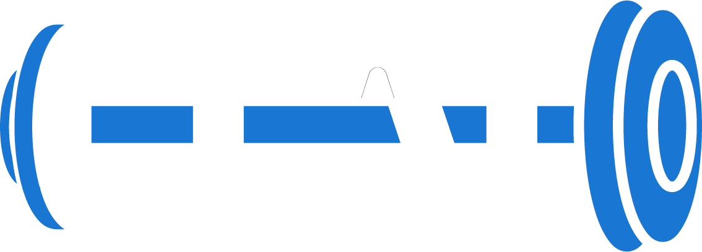
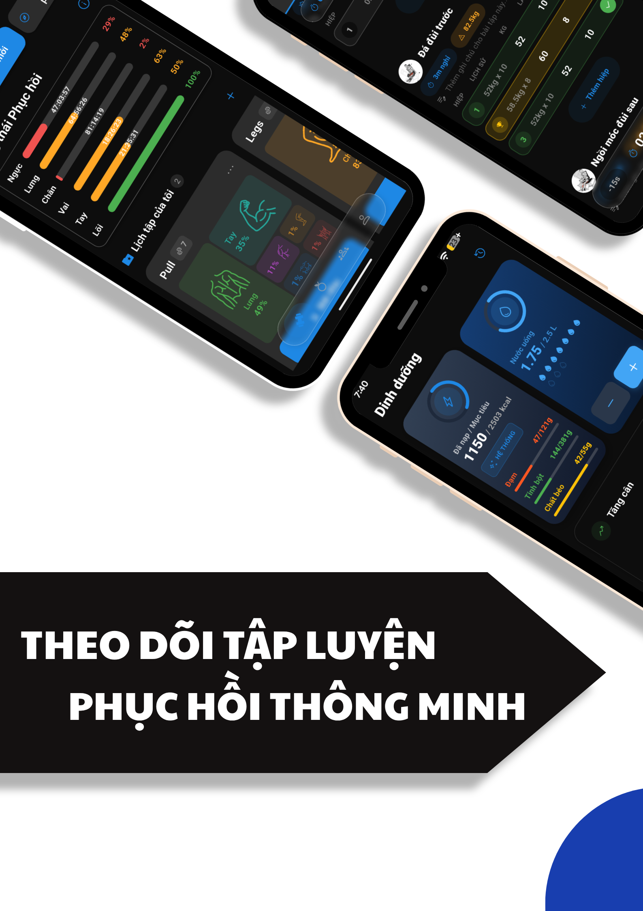
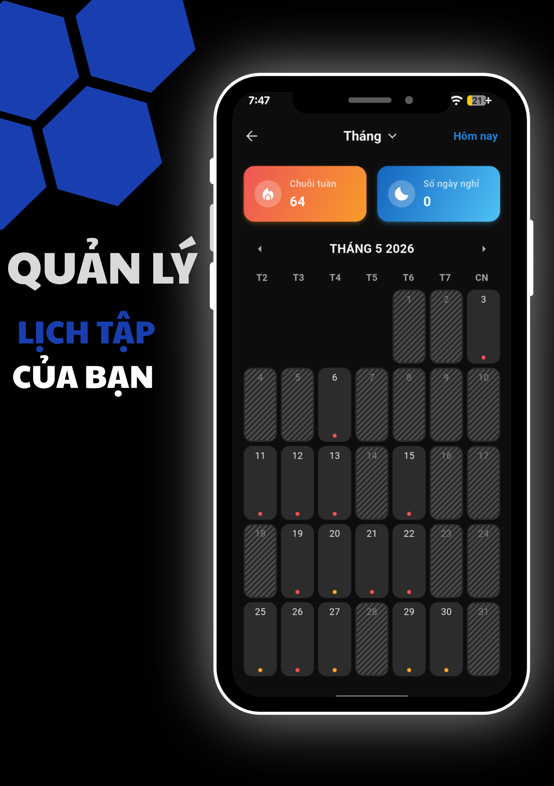
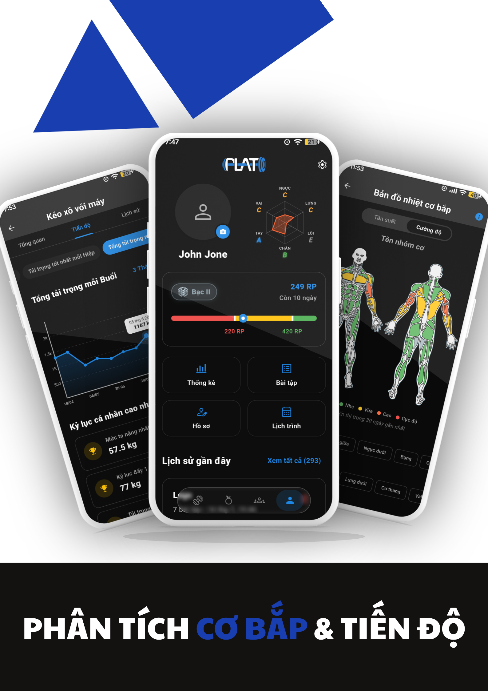
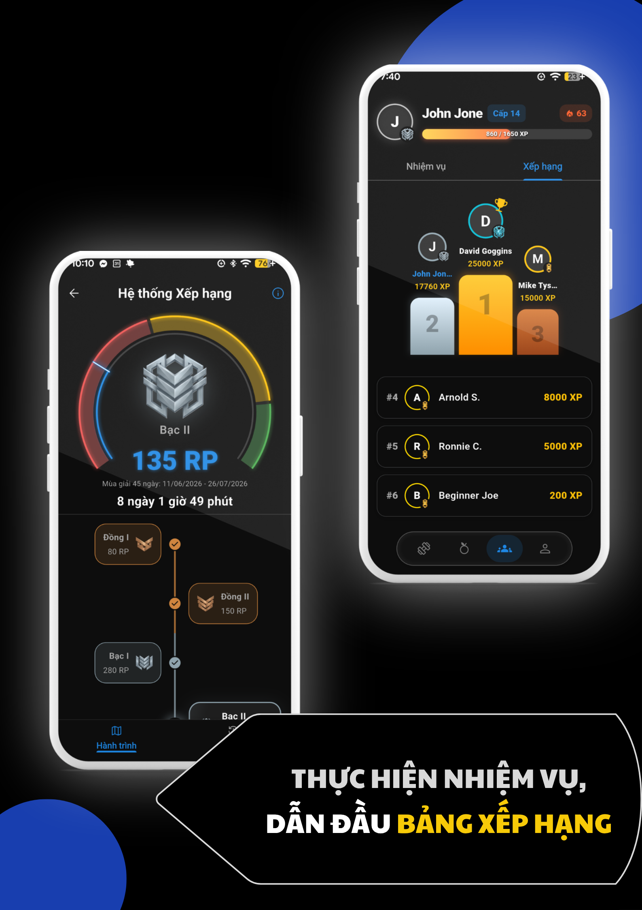

# Plato - Gym Log Workout & Nutrition

<p align="left">
  
  &nbsp;&nbsp;&nbsp;&nbsp;
  
</p>


**Plato** is an advanced, local-first Flutter fitness application engineered to optimize your workout planning, session tracking, and nutritional monitoring. Powered by a robust gamification engine, Plato encourages consistency through XP accumulation and competitive ranking tiers.

Designed with a strong emphasis on performance, intuitive UI/UX, and complete offline capabilities, Plato ensures that your fitness data is always accessible, seamlessly syncing whenever a connection is restored.

---

## 📸 Visual Showcase

*A quick glance at the premium UI/UX, advanced analytics, and workout tracking features.*

<p align="left">
  
  
  
  
</p>

---

## 🌟 Core Features

### 🏋️ Advanced Workout Tracking
- **Routine Management:** Leverage bundled fitness programs or meticulously design, duplicate, and reorder custom routines tailored to your goals.
- **Comprehensive Exercise Library:** Access a vast repository of built-in exercises or create personalized entries complete with custom notes and media instructions.
- **Dynamic Session Player:** Execute active workouts with a persistent mini-player, intelligent rest timers, superset configurations, haptic feedback, and background service execution to prevent interruptions.
- **In-depth Analytics:** Monitor workout volume, estimated caloric expenditure, personal records (PRs), muscle group distribution, training load, and recovery metrics.
- **Versatile Set Types:** Seamlessly record various set types including weight/reps, reps-only, timed, distance, and step-based sets.

### 🥗 Nutrition & Diet Management
- **Daily Nutritional Log:** Meticulously track meals, caloric intake, macronutrients (protein, carbohydrates, fat), and hydration levels.
- **Smart Dietary Targets:** Automatically generate personalized nutrition targets based on biometric profile, objectives, and physical metrics, with manual overrides for granular control.
- **Historical Trends & Analytics:** Easily replicate previous meals and analyze historical nutritional trends to maintain dietary consistency.

### 📈 Profile & Biometric Progress
- **Intelligent Onboarding:** Personalize the application experience by configuring body measurements, experience level, workout environment, schedule, goals, and dietary preferences.
- **Visual Progress Tracking:** Monitor weight fluctuations and activity frequency via interactive heatmaps.
- **Advanced Data Visualization:** Utilize sophisticated charts to visualize training loads, muscle recovery states, and comprehensive workout histories.

### 🎮 Gamification Engine
- **XP & Achievement System:** Earn XP and unlock exclusive rewards by maintaining consistency and surpassing personal records.
- **Dynamic Ranking System:** Advance through competitive tiers and ranks. Rank calculations and seasonal promotions/demotions are dynamically managed by the `RankCalculator` over 45-day cycles.

### 📱 Premium App Experience
- **Responsive Architecture:** Meticulously optimized layouts for Narrow Mobile, standard Mobile, Tablet, and Desktop environments utilizing `responsive_framework`.
- **Localization (i18n):** Full multilingual support (Vietnamese and English) powered by the robust `slang` package.
- **Non-blocking Background Sync:** Seamless cloud data synchronization ensures data integrity without hindering user interaction.

---

## 🛠 Technology Stack

Plato utilizes a modern and robust Flutter ecosystem, adhering to best practices to ensure a maintainable, scalable, and highly performant codebase:

| Category | Implementation / Package |
| :--- | :--- |
| **Framework** | Flutter & Material Design 3 |
| **State Management** | `flutter_bloc` (Cubits) |
| **Routing** | `go_router` (Stateful Multi-tab Shell) |
| **Dependency Injection**| `get_it` & `injectable` |
| **Local Database** | `floor` (SQLite) |
| **Backend & Auth** | Supabase (`supabase_flutter`) |
| **Data Serialization** | `freezed` & `json_annotation` |
| **Localization (i18n)** | `slang_flutter` (Type-safe i18n) |
| **Background Tasks** | `workmanager` & `flutter_background_service` |
| **Media & Animations** | `just_audio`, `video_player`, `vibration`, `lottie` |

---

## 📂 Project Architecture

The project strictly adheres to a **Feature-First (Modular)** architecture combined with **Clean Architecture** principles within each feature module. The application code is centralized within the `plato_gymapp/` directory.

```text
plato_gymapp/lib/
├── main.dart
├── core/
│   ├── bloc/             # Global App State (e.g., Guided Tours, Theme)
│   ├── database/         # Floor DB, DAOs, Entities, and Migrations
│   ├── designsystem/     # Theming, Colors, Shapes, and Reusable UI Components
│   ├── di/               # GetIt and Injectable configurations
│   ├── navigation/       # AppRouter, GoRouter configuration
│   ├── network/          # Supabase Client Initialization
│   └── worker/           # Background Sync and Foreground Workout Services
├── features/
│   ├── auth/             # Onboarding, OTP Authentication, User Sessions
│   ├── gamification/     # XP, Ranks, Rewards, RankCalculator Domain
│   ├── nutrition/        # Food Tracking, Macro Calculation
│   ├── profile/          # Settings, Body Metrics, Stats, Calendar
│   └── workout/          # Exercise Library, Routine Editor, Active Session Player
└── i18n/                 # Localization & Translations
    ├── strings_en.i18n.json # English Strings
    └── strings_vi.i18n.json # Vietnamese Strings (Default)
```

**Key Resource Directories (`plato_gymapp/assets/`):**
```text
plato_gymapp/assets/
├── init_data.sql         # Bundled master data (Exercises & Foods)
├── logo/                 # Application logos and splash screen assets
├── lottie/               # High-quality Lottie animations
├── svg/                  # Vector graphics (Muscle maps, UI icons)
├── gifs/                 # Exercise demonstration GIFs
└── sounds/               # Audio cues for timers and interactions
```

---

## 🌍 Localization (i18n) System

Plato features a robust type-safe localization system powered by `slang`. All language strings are managed centrally to ensure high-quality translations across the application.

- **Translation Files:** Located in `plato_gymapp/lib/i18n/`.
- **Default Language:** Vietnamese (`strings_vi.i18n.json`).
- **Supported Languages:** Vietnamese, English (`strings_en.i18n.json`).

**Updating Translations:**
After adding or modifying translation keys in the JSON files, you must regenerate the dart code to maintain type safety:
```bash
cd plato_gymapp
dart run slang
```

---

## 🚀 Getting Started

### Prerequisites
- **Flutter SDK:** `^3.11.4`
- **IDE:** Android Studio, IntelliJ, or VS Code
- **Supabase Project:** Configured with the required tables and RPC functions.

### 1. Environment Configuration
Navigate to the `plato_gymapp` directory and create a `.env` file:
```bash
cd plato_gymapp
touch .env
```
Populate it with your Supabase credentials:
```dotenv
SUPABASE_URL=https://your-project.supabase.co
SUPABASE_ANON_KEY=your-public-anon-key
```
> **Warning:** Only put the public `ANON_KEY` in the `.env` file. Never expose your `SERVICE_ROLE` key in the frontend repository.

### 2. Install Dependencies
```bash
cd plato_gymapp
flutter pub get
```

### 3. Code Generation
Plato relies on generated code for DI, database schemas, serialization, and localization. Run the build runner to generate the necessary files:
```bash
cd plato_gymapp
dart run build_runner build --delete-conflicting-outputs
```
*(For active development, use `watch` instead of `build`)*

### 4. Run the Application
```bash
cd plato_gymapp
flutter run
```

---

## ✅ Code Quality & Testing

Maintain code quality by formatting, analyzing, and running unit tests:
```bash
cd plato_gymapp
dart format --output=none --set-exit-if-changed lib test
flutter analyze
flutter test
```
> **Note:** Mobile-specific features (Foreground Services, Notifications) require testing on physical devices or emulators, and cannot be fully validated via standard Flutter tests alone.

---

## 🔒 Security & Release Setup

### Environment Variables (`.env`)
The `.env` file is strictly ignored by Git (`.gitignore`) to prevent credential leaks. **Never commit the `.env` file.** It should only contain your `SUPABASE_URL` and `SUPABASE_ANON_KEY`. Your `SERVICE_ROLE_KEY` must remain securely on your backend and should never be exposed in this Flutter client.

### App Signing & Keystore (Chữ ký số)
To build the app for Google Play (Release mode), you need the production keystore (Chữ ký số).
- **Android:** The `keystore.jks` and `key.properties` files are excluded from source control. You must manually place `key.properties` inside the `android/` directory on your build machine. **NEVER commit your keystore file or passwords to the repository.**
- **iOS:** Managed via Xcode. Production certificates should be securely handled via your team's Apple Developer Account or Fastlane Match.

---

## 🧠 Business Logic & Guidelines

Feature-specific rules and logic are strictly encapsulated within their respective domain layers. Refer to domain-specific documentation for complex logic (e.g., `RankCalculator`, `RecoveryCalculator`) to avoid polluting Presentation/UI widgets.